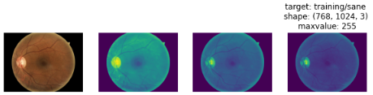

# Tensorflow Computer Vision 
# Diabetic Retinopathy Arranged

Thanks to   

[Lorence Moroney](https://github.com/https-deeplearning-ai/tensorflow-1-public)
[mrdbourke](https://github.com/mrdbourke/tensorflow-deep-learning)  

Diabetic Retinopathy Arranged
Computer vision is the practice of writing algorithms which can discover patterns in visual data. 

In this work a **Convolutional Neural Network** (CNN) will classify the images from Kaggle dataset [Diabetic Retinopathy Arranged](https://www.kaggle.com/datasets/amanneo/diabetic-retinopathy-resized-arranged?select=0)  

The original datset came with images divided in 5 folder (0,1,2,3,4), each of them represents specific class labels.

0 - No DR - **No Diabetic Retina**: there are 25810 images.
1 - Mild - **Diabetic Retina Mild**: there are 2443 images .
2 - Moderate - **Diabetic Retina Moderate** : there are 5292 images
3 - Severe - **Diabetic Retina Severe** : there are 873 images
4 - Proliferative DR - **Diabetic Retina Proliferative** : there are 708 images

This 2 Notebooks provides a complete set of code to train and leverage own custom computer vision using the Tensorflow API. 
