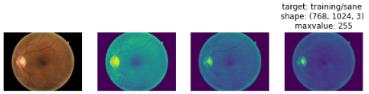
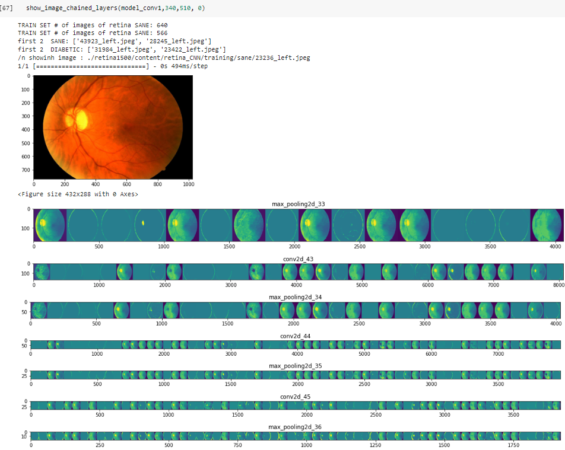

# Tensorflow Computer Vision 
# Diabetic Retinopathy Arranged

> A personal project from **2022**. I'm a senior data / backend engineer — Java and Apache Spark
> on the JVM — and I built this on my own time, after working through the **DeepLearning.AI
> TensorFlow Developer Professional Certificate**, to understand machine learning from the
> inside rather than from blog posts. Notes on what I'd do differently today are at the bottom.

Thanks to   

[Lorence Moroney](https://github.com/https-deeplearning-ai/tensorflow-1-public)  
[mrdbourke](https://github.com/mrdbourke/tensorflow-deep-learning)  

Computer vision is the practice of writing algorithms which can discover patterns in visual data. 

In this work **Convolutional Neural Networks** (CNN) will classify the images from Kaggle dataset [Diabetic Retinopathy Arranged](https://www.kaggle.com/datasets/amanneo/diabetic-retinopathy-resized-arranged?select=0)  

The original datset came with images divided in 5 folder (0,1,2,3,4), each of them represents specific class labels.

* 0 - No DR - **No Diabetic Retina**: there are 25810 images.
* 1 - Mild - **Diabetic Retina Mild**: there are 2443 images .
* 2 - Moderate - **Diabetic Retina Moderate** : there are 5292 images
* 3 - Severe - **Diabetic Retina Severe** : there are 873 images
* 4 - Proliferative DR - **Diabetic Retina Proliferative** : there are 708 images

This 2 Notebooks provides a complete set of code to train and **predict** sane retina from diabetic retina  using   
the Tensorflow API applied on building CNN.  

Below a sample of retina image processed by **1,6mln** CNN's neurons in a less than a blink of an eye.  
 
 

---

## What I learned

The modelling turned out to be the easy part. The hard problems were the ones that look like
engineering problems rather than ML ones — above all the class imbalance: 25,810 images in class 0
against 708 in class 4 means a model can score well on paper while being useless exactly where it
matters most, on the severe cases. Accuracy is close to meaningless on a distribution like this one.

That lesson — that the difficulty in an ML system sits *around* the model rather than inside it —
is the one that carried over into everything I've built since.

## What I'd do differently now

- **Fix the imbalance explicitly**, and report per-class recall rather than overall accuracy.
  On a medical dataset, missing the rare severe class is the only error that really counts.
- **Start from a pretrained backbone.** Fine-tuning a modern pretrained vision model would beat
  a network trained from scratch here, at a fraction of the compute.
- **Define the evaluation before the model** — a held-out set with per-class metrics and
  calibration, decided up front.
- **Make it reproducible**: pinned dependencies, seeded runs, a container. As it stands this is a
  pair of notebooks, and a notebook is not a system.

That last point is where my work has gone since. I build the production layer around data and
ML systems — evaluation, guardrails, observability, containerised deployment — which is usually
what decides whether any of this survives contact with production.

---

**Alessandro Bruni** — Senior Data / Backend Engineer · Java · Apache Spark · AWS / Azure
[alessandrobruni.github.io](https://alessandrobruni.github.io) · [LinkedIn](https://linkedin.com/in/bruni-alessandro)

